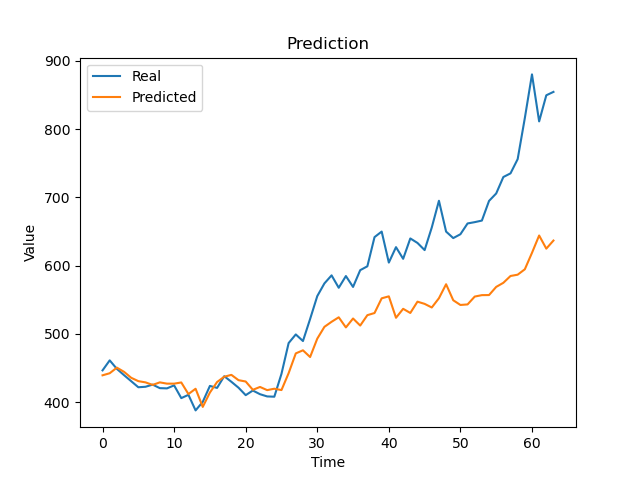

# Prediccion de acciones en bolsa
***
Using tensorflow, a neural network is trained that can make predictions about stocks in the stock market  
The model uses LSTM layers because they are very useful to analyze data over time  
To be able to build the network use tensorflow and keras  
The data used for the training was the actions of tesla from 2018 to 2021 giving a total of 764 data  
Of the 764 data, 700 will be used for training, the rest will be used for data validation.

### We plot the results of the network
***
  
As can be seen in the image, the network has considerable results within 1 day of prediction to less than 1 month

### How to install and run the script
***
<code>$ git clone https://github.com/zeusdh/Prediccion-de-acciones-en-bolsa.git</code>  
<code>$ cd Prediccion-de-acciones-en-bolsa/</code>  
If we want to train the model we just have to put the following  
<code>$ python3 train.py</code>  
If we only want to test the model we only put  
<code>$ python3 main.py</code>
